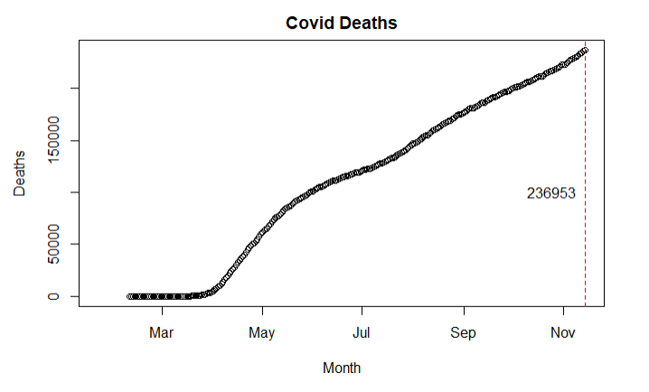
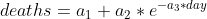

# Covid_Tracker_US
A visualization and Non-Linear Regression model of Covid-19 in the US

By tracking Coronavirus cases across the US we can see the areas most impacted by the virus. We can also create models to predict how the virus will develop in the upcoming months. These models can be used to manage response efforts and allocate resources to the appropriate places.

Below is a gif which show the development of COVID cases and deaths as of 11/14/2020.

If we visualize all deaths across time we can get a sense of the type of model we want to build.

COVID cases appear to be rising linearly or exponentially. A fair model to try to fit this on is an exponential function which plateaus. 

By using this equation to model COVID deaths we can obtain estimates for the coefficients (a1, a2, a3) and find predictions for deaths in upcoming months/years.

We can build a model that assumes and exponential curve:

We can test to see if we will reach 1 million deaths in America. We obtain a p-value >0.05 indicating that we cannot reject that the curive might hit 1 million deaths.

This model assumes that deaths will rise exponentially before plateauing and does not take into account the administration of a vaccine which should dampen the number of deaths. Future steps include updating the deaths to include those through February 1st as well as adding a dampening factor into the Non-Linear Regression Model to account for vaccine administration and to model how that will affect deaths across the US.
